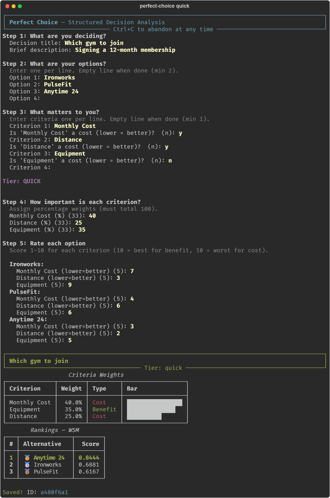
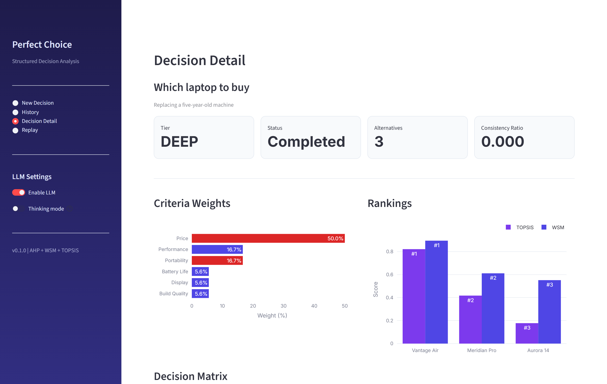
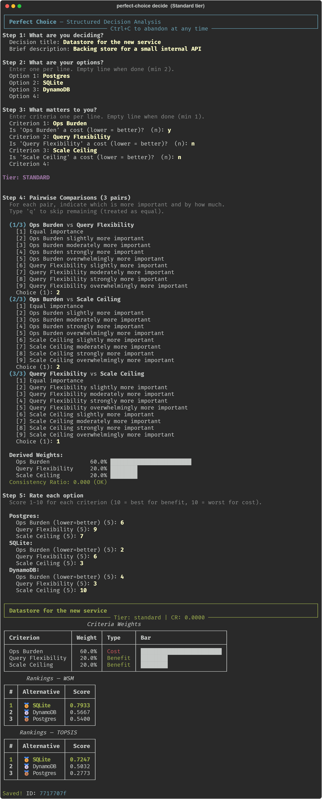
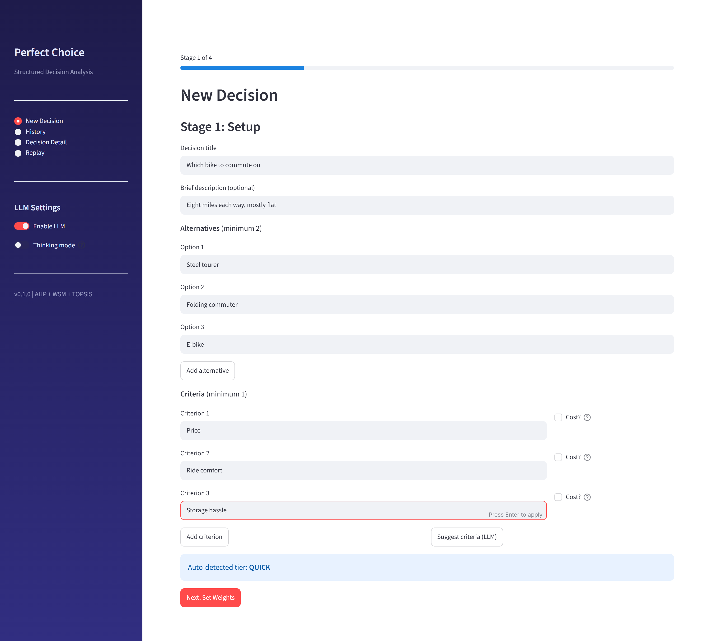
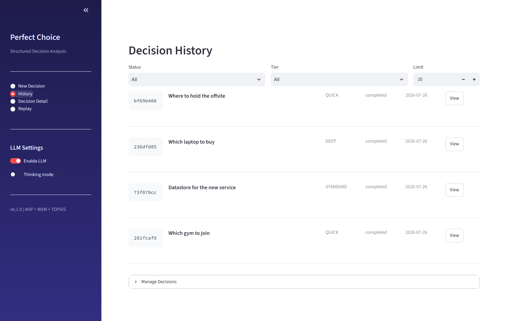
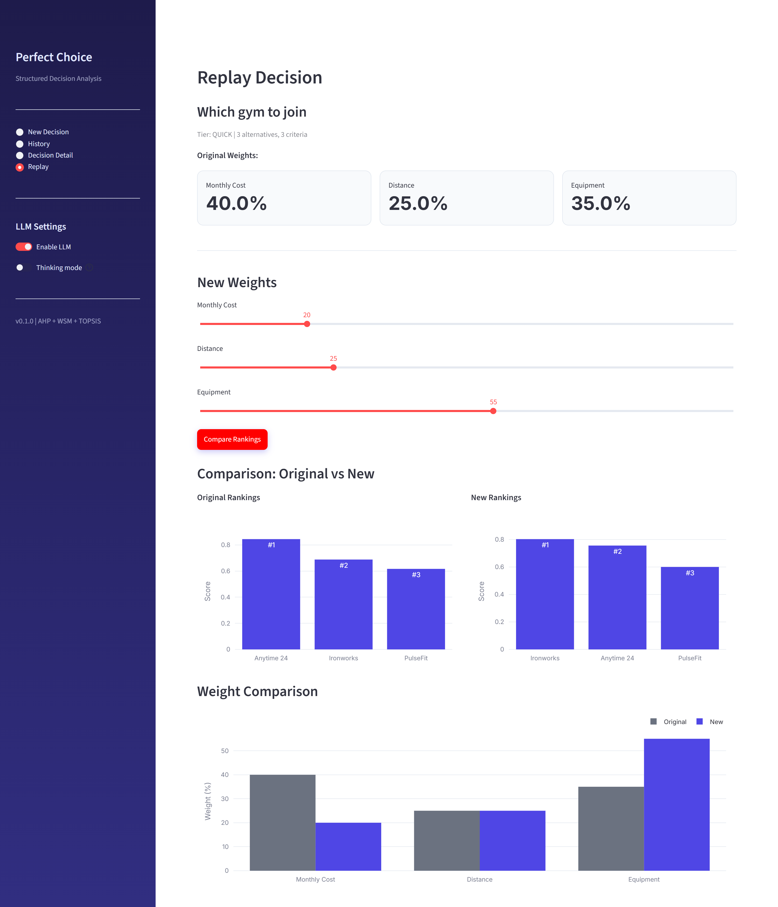

# Perfect Choice

**Stop agonising over decisions. Answer a few questions, get a ranked answer you can defend.**

[](https://www.python.org/downloads/)
[](LICENSE)
[](#run-the-tests)
[](#do-i-need-an-api-key)

Perfect Choice turns "I can't decide" into arithmetic. You list your options,
list what you care about, say how much each thing matters, and score each
option. It does the rest and shows its work.

No account. No API key. No internet. Everything stays in a file on your own
computer.

---

## See it work

Here is a complete session. Nothing is mocked up — this is the real terminal
output, top to bottom.



Notice the answer: **Anytime 24 wins even though Ironworks has better
equipment**, because price and distance were marked as *costs* (lower is
better) and together they outweigh the gym gear. That is the entire point —
the maths catches trade-offs your gut quietly ignores.

### And there's a dashboard



---

## Table of contents

- [Install it](#install-it)
- [Your first decision (3 minutes)](#your-first-decision-3-minutes)
- [The dashboard](#the-dashboard)
- [Every command](#every-command)
- [How the maths works](#how-the-maths-works)
- [Settings](#settings)
- [Optional extras](#optional-extras)
- [Run the tests](#run-the-tests)
- [Troubleshooting](#troubleshooting)
- [FAQ](#faq)

---

## Install it

### Step 0 — check you have Python

You need **Python 3.11 or newer**. Open a terminal and check:

```bash
python --version
```

If that prints `Python 3.11.x` or higher, you are good. If it says
"command not found" or shows 3.10 or lower, install Python from
[python.org/downloads](https://www.python.org/downloads/) first.

> On some systems the command is `python3` instead of `python`. If `python`
> doesn't work, try `python3` everywhere in this README.

### Step 1 — download the code

```bash
git clone https://github.com/YOUR-USERNAME/perfect-choice.git
cd perfect-choice
```

No git? Click the green **Code** button at the top of this page →
**Download ZIP**, unzip it, and `cd` into the folder.

### Step 2 — make a virtual environment

This keeps Perfect Choice's dependencies away from the rest of your system.
Skipping it will probably still work, but this is the safe path.

**macOS / Linux**

```bash
python -m venv .venv
source .venv/bin/activate
```

**Windows (PowerShell)**

```powershell
python -m venv .venv
.venv\Scripts\Activate.ps1
```

Your prompt should now start with `(.venv)`.

### Step 3 — install

```bash
pip install -e ".[dashboard,charts]"
```

That's it. Three things are now available:

| What | Command |
|---|---|
| The quick wizard | `perfect-choice quick` |
| The full wizard | `perfect-choice decide` |
| The web dashboard | `perfect-choice dashboard` |

> **Just want the command line?** `pip install -e .` installs the core only —
> smaller and faster. The dashboard needs the `dashboard` extra; `charts`
> adds in-terminal bar graphs.

---

## Your first decision (3 minutes)

Run:

```bash
perfect-choice quick
```

It walks you through five steps. Here is what each one is asking for:

**Step 1 — What are you deciding?**
A short title. `Which gym to join` is fine. If your title mentions a laptop,
a job offer, a car, an apartment, a holiday or a college, Perfect Choice
offers a ready-made list of criteria for that kind of decision.

**Step 2 — What are your options?**
Type one per line. Press Enter on a blank line when you're done. You need at
least two.

**Step 3 — What matters to you?**
Type your criteria one per line, again blank line to finish. For each one it
asks *"is this a cost?"* — answer **y** if a *lower* number is better (price,
commute time, effort) and **n** if a *higher* number is better (comfort,
quality, salary). This is the single most important question in the whole
tool; get it right and everything else follows.

**Step 4 — How important is each one?**
Give each criterion a percentage. They must add up to 100. If they don't,
it asks again rather than quietly guessing.

**Step 5 — Score each option**
Rate every option on every criterion from 1 to 10. For benefit criteria,
10 is best. For cost criteria, 10 is *worst* (it's the most expensive, the
longest drive) — the tool reminds you on screen.

Then it prints the ranking and saves it. Bring it back any time:

```bash
perfect-choice list           # everything you've decided
perfect-choice review 3f9c    # the full breakdown (first few ID characters is enough)
```

### Want more rigour? Use the full wizard

`perfect-choice decide` adds a **Standard** and **Deep** tier. Instead of
typing percentages, you compare criteria two at a time — "is price more
important than battery life, and by how much?" — and it derives the weights
for you. It also computes a **consistency ratio** that tells you whether your
answers contradicted each other.



That run picked SQLite over Postgres and DynamoDB, and the consistency ratio
of 0.000 says the comparisons were internally coherent. Anything above 0.10
and the tool offers to let you redo them.

---

## The dashboard

Prefer clicking to typing?

```bash
perfect-choice dashboard
```

Your browser opens at `http://localhost:8501`. It's the same engine and the
same saved decisions — just a different front door.

### Build a decision by filling in a form



### Browse everything you've decided



### Ask "what if I'd cared about different things?"

This is the feature people keep. Load an old decision, drag the weights
around, and watch the ranking rearrange itself:



Caring less about price and more about equipment flips the winner from
Anytime 24 to Ironworks. If a small nudge flips your answer, your decision
was closer than it felt — worth knowing before you commit.

---

## Every command

```bash
# Making decisions
perfect-choice quick                        # fast path: type percentages
perfect-choice decide                       # full wizard, picks its own tier
perfect-choice decide --template job_offer  # start from built-in criteria
perfect-choice dashboard                    # web UI

# Looking back
perfect-choice list                         # all past decisions
perfect-choice review <id>                  # one decision in full
perfect-choice replay <id>                  # re-rank with different weights
perfect-choice outcome <id>                 # record how it actually turned out (1-10)

# Moving data around
perfect-choice export <id>                  # to Markdown or JSON
perfect-choice import data.json             # from JSON or CSV
perfect-choice brain-sync                   # push to a memory webhook (optional)
```

IDs are long, but you only ever need the first few characters.

Built-in templates: `job_offer`, `apartment`, `car`, `laptop`, `vacation`,
`college`.

---

## How the maths works

Three well-established methods, no black boxes:

| Step | Method | What it does |
|---|---|---|
| Weights | **AHP** (Analytic Hierarchy Process) | Turns "A matters a bit more than B" into numbers, and warns you if your comparisons contradict each other |
| Ranking | **WSM** (Weighted Sum Model) | Normalises every score, multiplies by its weight, adds them up |
| Cross-check | **TOPSIS** | Ranks by distance from the best-possible and worst-possible option |
| Stress test | **Sensitivity analysis** | Finds how far each weight would have to move before the winner changes |

Two methods, not one, because they can disagree — and when they do, that
tells you the top options are genuinely close.

The AHP engine uses power iteration and has no numpy dependency; the whole
core install is three small packages.

Your decisions live in a single SQLite file at
`~/.perfect-choice/decisions.db`. Back it up by copying that file.

---

## Settings

Everything is optional. Perfect Choice runs with nothing configured.

| Variable | Default | What it does |
|---|---|---|
| `PERFECT_CHOICE_DB_PATH` | `~/.perfect-choice/decisions.db` | Where your decisions are stored |
| `PERFECT_CHOICE_LLM_URL` | `http://localhost:8080` | An OpenAI-compatible endpoint for the optional AI features |
| `PERFECT_CHOICE_LLM_MODEL` | *(server default)* | Which model to ask for |
| `PERFECT_CHOICE_LLM_TIMEOUT` | `300` | Seconds to wait for the model |
| `PERFECT_CHOICE_NO_LLM` | *(unset)* | Set to `1` to skip the AI entirely |
| `PERFECT_CHOICE_BRAIN_URL` | *(unset)* | Optional webhook to POST finished decisions to |

Copy `.env.example` to `.env` and edit it — a `.env` file in the folder you
run from is picked up automatically.

---

## Optional extras

Both of these are **off unless you turn them on**, and the tool is fully
functional without either.

### A local AI model

If you run a local model server that speaks the OpenAI API — llama.cpp,
LM Studio, Ollama, vLLM — Perfect Choice can use it to suggest criteria you
hadn't thought of, flag likely biases in your comparisons, and write a
summary. Point `PERFECT_CHOICE_LLM_URL` at it.

With no model reachable, the wizard prints
`LLM unavailable — running in math-only mode` and carries on. Every number in
this README was produced without a model.

### A memory webhook

Set `PERFECT_CHOICE_BRAIN_URL` and each completed decision is POSTed there as
JSON, so an external notes or knowledge system can keep your decision history.
Leave it unset and no network call is ever made.

---

## Run the tests

```bash
pip install -e ".[dev]"
pytest tests/ -q
```

209 tests, about 4 seconds. They are not only unit tests of the arithmetic —
`test_interactive.py` drives the real CLI wizard question by question and
checks the winner against hand-calculated values, and `test_dashboard.py`
drives the real Streamlit app through Streamlit's own `AppTest`. If either
interface breaks, the suite goes red.

Every test runs with real HTTP and subprocess calls blocked, so nothing
touches the network.

---

## Troubleshooting

**`perfect-choice: command not found`**
Your virtual environment isn't active. Re-run the activate command from
Step 2. You'll know it worked when your prompt starts with `(.venv)`.

**`ModuleNotFoundError: No module named 'streamlit'`**
You installed the core only. Run `pip install -e ".[dashboard]"`.

**The wizard says my weights don't total 100**
They must add to exactly 100. It re-asks rather than silently rescaling,
because a rescaled weight is not the weight you meant.

**"Consistency Ratio: 0.184 — comparisons are inconsistent"**
You said A > B, B > C, but then C > A (or something equally circular). It
offers to let you redo them. You can also accept it — it's a warning, not an
error.

**The terminal charts look like garbage, or the wizard stops after saving**
Your terminal can't render the block characters the charts use. Perfect Choice
detects this and falls back to plain tables automatically. If you'd rather not
have charts at all, install without the extra: `pip install -e .`

**`perfect-choice dashboard` opens but the page is blank**
Give it a few seconds on first launch. If it persists, run
`streamlit run src/perfect_choice/dashboard/app.py` directly to see the error.

**Where did my decisions go?**
`~/.perfect-choice/decisions.db` — that is `C:\Users\<you>\.perfect-choice\`
on Windows. Set `PERFECT_CHOICE_DB_PATH` to move it.

---

## FAQ

**Do I need an API key?**
No. There is nothing to sign up for and no paid service anywhere in this
project.

**Does it send my data anywhere?**
No. The only outbound requests it can ever make are to a local AI model you
configured yourself, or to a webhook URL you set yourself. Both are off by
default. The test suite enforces this — there is a test that fails if an
unconfigured install makes a network call.

**Is this just a spreadsheet with extra steps?**
Partly, and that's the point — a spreadsheet won't tell you that your
importance ratings contradict each other, or how far a weight can move before
the answer changes. That's the AHP consistency ratio and the sensitivity
analysis.

**Can I use it for real decisions?**
That's what it's for. It won't decide for you; it makes your own reasoning
explicit enough to argue with.

---

## Project layout

```
src/perfect_choice/
├── cli.py              # command-line entry point
├── interactive.py      # the terminal wizard
├── ahp.py              # AHP weights (power iteration, no numpy)
├── scoring.py          # WSM + TOPSIS
├── sensitivity.py      # how far weights can move before the winner changes
├── models.py           # immutable data types
├── db.py               # SQLite storage
├── templates.py        # six built-in decision templates
├── importer.py         # CSV / JSON import
├── llm.py              # optional model client
├── brain.py            # optional memory webhook
└── dashboard/          # Streamlit app: new decision, history, detail, replay
```

## License

MIT — see [LICENSE](LICENSE). Do what you like with it.
